# Hot Monitor

Hot Monitor（AI 情报台）是一个面向研发团队的 AI 热点监控工具。它围绕用户添加的监控关键词，自动从多个渠道采集 AI 技术动态，经 AI 研判（相关性、技术性、可信度）筛选后，在网页控制台呈现一份"值得看、值得分享"的热点情报流，帮助研发人员更快跟踪值得关注的信息。

一句话概括：**你定关键词，它定时扫，AI 打分筛选，你只看精华。**

## 你将运行什么

- 后端 API：默认运行在 `http://localhost:8787`
- Web 控制台：默认运行在 `http://localhost:5173`
- 本地数据库：首次启动时自动创建在 `data/hot-monitor.db`

不配置任何 API Key 也可以启动项目，并使用 RSS 来源和本地规则完成基础体验。

## 开始前准备

1. 安装 [Node.js LTS](https://nodejs.org/)，建议使用 20 或更高版本。
2. 安装 [Visual Studio Code](https://code.visualstudio.com/)。
3. 将项目文件夹下载或克隆到本机。

在 VS Code 中点击"文件" -> "打开文件夹"，选择本项目的 `hot_monitor` 文件夹。

然后点击"终端" -> "新建终端"，输入下面的命令检查 Node.js 是否可用：

```powershell
node -v
npm -v
```

两个命令都能显示版本号即可继续。

## 第一次启动

在 VS Code 底部终端中，确认当前目录是项目根目录（能看到 `package.json`），依次执行：

```powershell
npm install
npm --prefix client install
npm run dev
```

说明：前两条命令会分别安装后端和前端依赖，首次执行需要等待一会儿；最后一条命令会同时启动前后端。看到类似以下内容说明启动成功：

```text
Hot Monitor API listening on http://localhost:8787
Local: http://localhost:5173/
```

在浏览器打开 [http://localhost:5173](http://localhost:5173)，即可进入 Hot Monitor 控制台。

## 第一次使用

1. 在页面中添加一个监控关键词，例如 `AI 编程`、`大模型` 或 `智能体`。
2. 点击手动扫描，等待扫描完成。
3. 在热点列表中查看标题、摘要、来源和相关性信息；点击来源可打开原始页面。

首次扫描没有结果并不代表启动失败：可先确认关键词已启用，并检查页面中的来源状态。RSS 来源需要能够访问互联网，网页、X/Twitter 来源还需要配置相应密钥。

## 功能介绍

> 以下内容基于 2026-09-21 实际运行截图整理，所有截图见 `docs/screenshots/` 目录。

### 整体界面

控制台为单页应用，深色科技风设计（含聚光灯、流星、光束等动态背景，遵循系统"减弱动态效果"设置时自动关闭）。页面布局如下：

| 区域 | 作用 |
| --- | --- |
| 顶部页头 | 品牌 LOGO、服务在线状态、下次自动扫描倒计时、「立即扫描」按钮 |
| Hero 横幅 | 当日日期、主题标语、下一轮收集时间（时:分:秒 实时倒计时） |
| 左侧「监控清单」面板 | 关键词管理 + 数据来源健康状态 |
| 右侧「最新情报」面板 | 情报流：搜索、筛选、排序、分页、已读管理 |

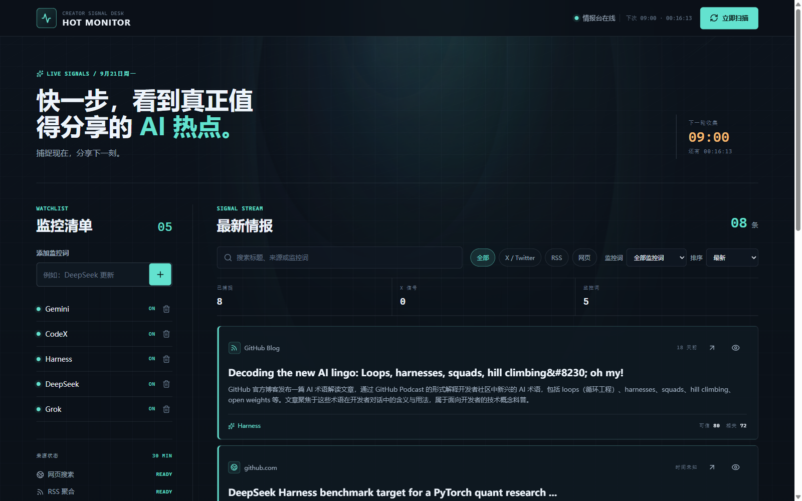

### 核心功能详解

#### 1. 监控关键词管理（左侧面板）

- **添加**：输入框输入关键词（如 `DeepSeek 更新`）回车即可添加，默认监控范围为"AI 大模型、AI 编程、开源模型、科技公司动态"。
- **启停**：点击关键词右侧开关，可在 ON / OFF 之间切换（OFF 的词不再参与扫描与筛选，不删除历史配置）。
- **删除**：点击垃圾桶图标，弹出确认框后删除。
- 面板标题处的数字徽标实时显示"当前启用中的监控词数量"。

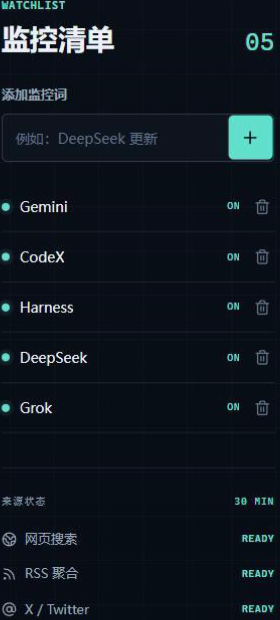

#### 2. 数据来源状态监控（左侧面板底部）

实时显示三类采集来源的就绪状态：

| 来源 | 说明 | 依赖配置 |
| --- | --- | --- |
| 网页搜索 | Firecrawl 搜索可信网页与新闻 | `FIRECRAWL_API_KEY` |
| RSS 聚合 | 内置 8 个高质量 RSS 源（Hugging Face Blog、OpenAI News、Google AI Blog、AWS ML Blog、微软研究院、GitHub Blog、TechCrunch AI、VentureBeat AI），每个源带内置质量分（78~96） | 无需配置，开箱即用 |
| X / Twitter | twitterapi.io 热门推文 | `TWITTERAPI_API_KEY` |

状态为 `READY` 即可正常采集；未配置密钥时显示 `CONFIG` 提示。

#### 3. 情报流查看与操作（右侧面板）

每条情报卡片包含：

- **来源信息**：来源类型图标（网页/RSS/X）、来源名称、相对发布时间（如"18 天前"，无时间显示"时间未知"）
- **标题 + AI 摘要**：摘要由 AI 生成，中文转述原文要点
- **两个操作**：外链图标跳转原文（新标签页打开）；眼睛图标标记已读（已读卡片半透明显示 + 绿色"已读"标签）
- **底部标签**：命中的监控词 + 两个量化评分——**可信分**（来源质量与 AI 判定综合）与**相关分**（与监控词的相关度）

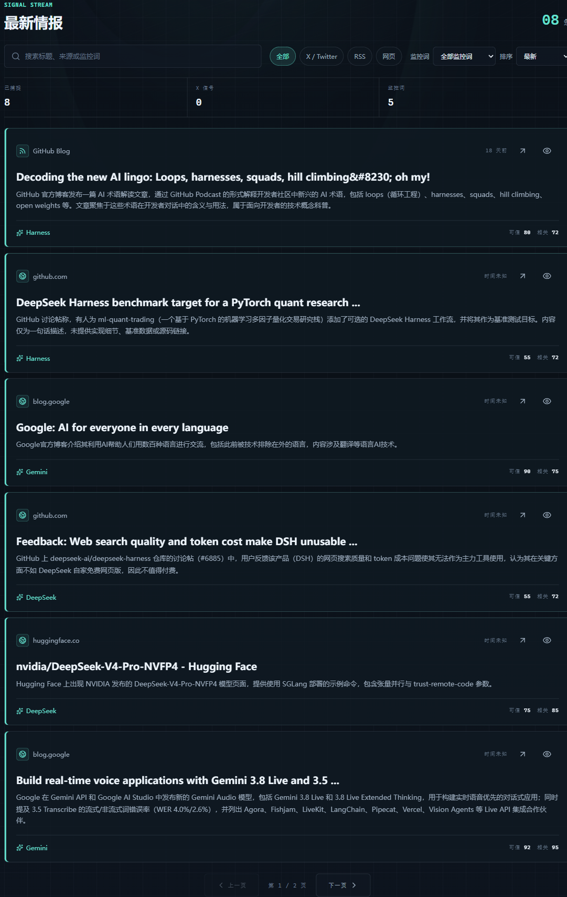

标记已读效果（第一条卡片变半透明，右上角出现"已读"）：

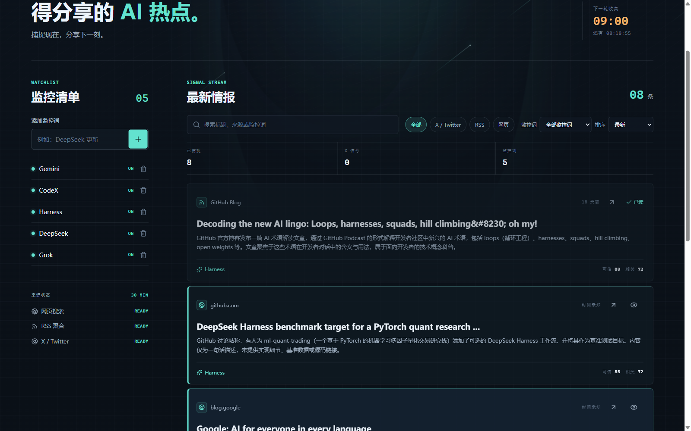

#### 4. 搜索、筛选与排序

- **搜索框**：按标题、摘要、来源名、监控词全文模糊搜索，实时过滤（如搜 `Gemini` 命中 3 条），支持一键清除。
- **来源筛选**：全部 / X·Twitter / RSS / 网页 四个快捷按钮。
- **监控词筛选**：下拉框只看某个监控词命中的情报。
- **排序**：`最新`（按发布时间倒序）或 `最相关`（按相关分倒序）。
- 任意筛选生效后出现**重置按钮**，一键恢复默认视图。

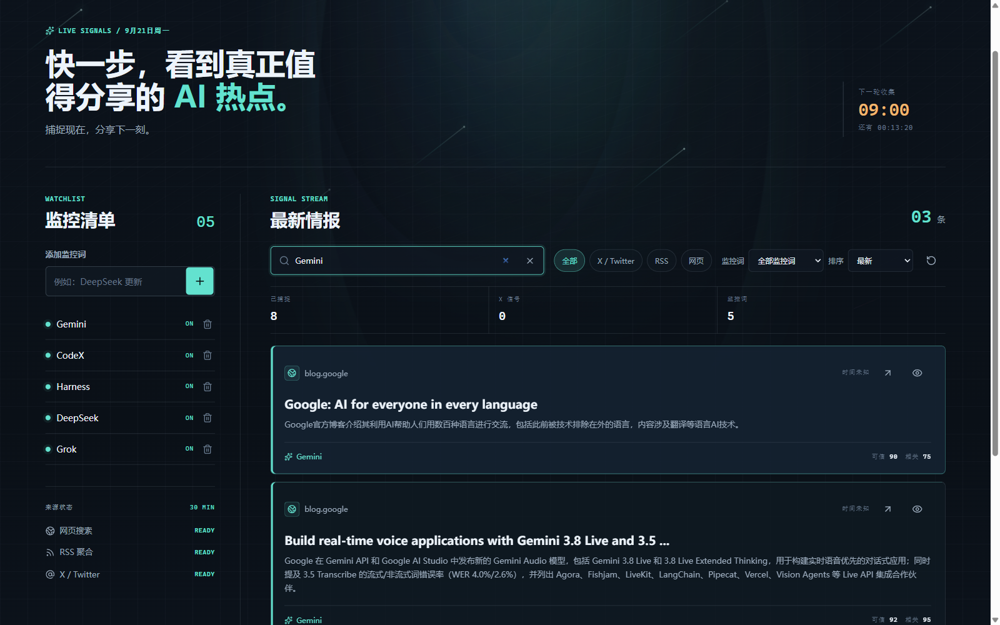

按"最相关"排序（相关分 95 → 95 → 75 依次排列）：

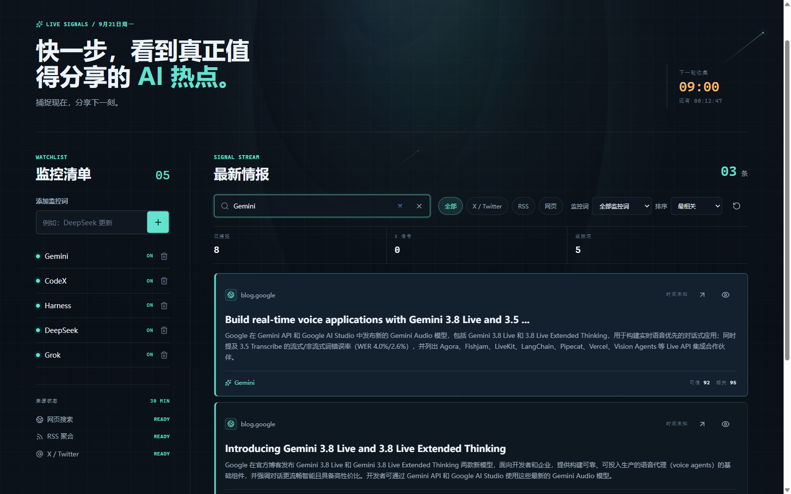

筛选无结果时的空状态提示（含"重置筛选"按钮）：

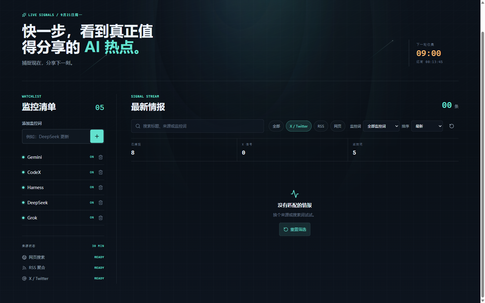

#### 5. 分页浏览

情报流每页固定 6 条，超过自动分页，支持上一页/下一页切换，页码实时显示。

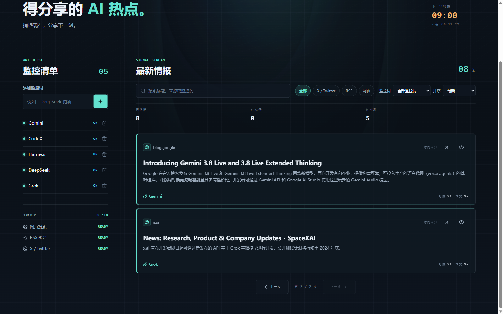

#### 6. 手动扫描与自动扫描

- **自动扫描**：后端每 30 分钟（每逢整点/半点）自动执行一轮采集，页头实时显示"下次扫描时间 + 倒计时"。
- **手动扫描**：点击右上角「立即扫描」立即触发。扫描过程中：
  - 页头状态变为"正在捕捉信号"，按钮显示转圈动画并禁用
  - 旧情报列表清空，显示"情报流暂时安静"占位
  - 扫描完成后通过 WebSocket 实时推送，页面自动刷新出新情报，无需手动刷新

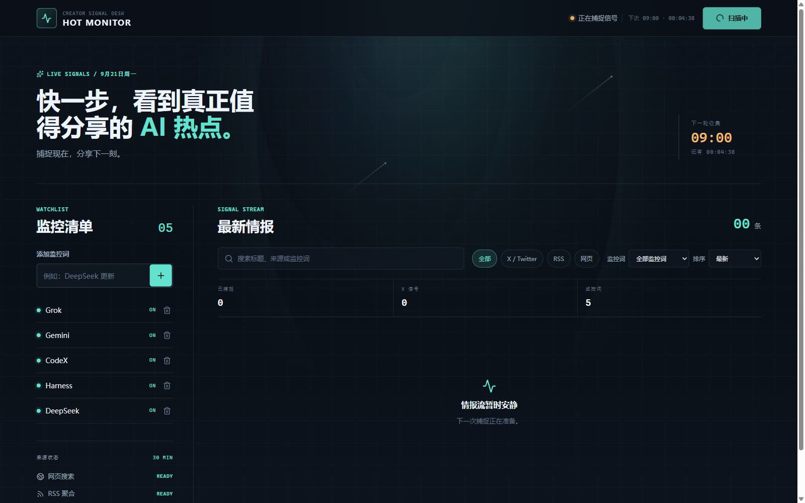

实测一次手动扫描：耗时约 3.5 分钟，从 78 条原始来源中筛选出 10 条入库，页面实时更新：

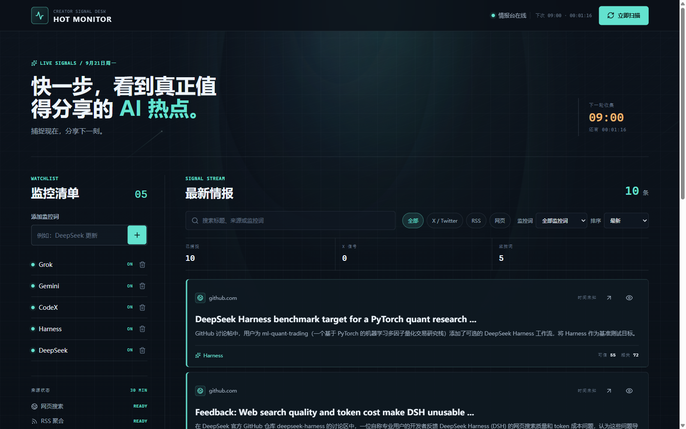

#### 7. 移动端适配

窄屏（如 375px 手机宽度）下自动切换为单列布局，监控面板与情报流纵向排列，可直接用手机浏览器访问。

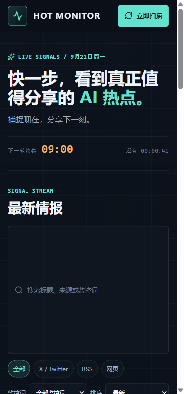

### 一次扫描的内部流程

结合源码，每轮扫描（`src/scan.ts`）的处理链条如下：

```
启用中的监控词
      │
      ▼
多渠道采集（RSS 8 源 + Firecrawl 网页搜索 + X/Twitter）──► 78 条原始信号
      │
      ▼
AI 逐条研判（DeepSeek，4 并发）：是否相关/技术性/内容类型/可信度分类/生成中文摘要
      │
      ▼
质量门槛过滤（story-selection.ts）：相关分、关键词聚焦分、可信分达标才保留；
非 Twitter 高质量来源有放宽的兜底通道；X 内容占比有上限控制
      │
      ▼
按综合分（相关 45% + 关键词聚焦 30% + 可信 25%）择优入库 ──► 10 条
      │
      ▼
WebSocket 推送前端实时刷新 + 可选邮件通知（SMTP）
```

### 技术架构速览

| 层 | 技术 | 说明 |
| --- | --- | --- |
| 前端 | React 19 + Vite 5 + TypeScript | 单页应用，Socket.IO 实时通信 |
| 后端 | Node.js + Express 5 + Socket.IO | REST API + WebSocket 推送 |
| 数据库 | SQLite（better-sqlite3） | 本地文件 `data/hot-monitor.db`，零运维 |
| AI 研判 | DeepSeek API | 相关性/技术性/可信度判定与中文摘要 |
| 采集 | RSS 直连 + Firecrawl + twitterapi.io | 三类来源互补 |
| 校验 | Zod | 请求参数校验 |

常用 API：

| 接口 | 方法 | 用途 |
| --- | --- | --- |
| `/api/health` | GET | 健康检查、来源状态、下次扫描时间 |
| `/api/keywords` | GET / POST | 查询 / 新增监控词 |
| `/api/keywords/:id` | PATCH / DELETE | 启停 / 删除监控词 |
| `/api/stories` | GET | 查询情报流（最多 100 条） |
| `/api/stories/:id/read` | PATCH | 标记已读 |
| `/api/scans` | POST | 触发手动扫描 |

## 可选：启用更多能力

基础启动不需要配置文件。需要启用 AI 研判、网页搜索或 X/Twitter 来源时，在项目根目录复制示例配置：

```powershell
Copy-Item .env.example .env
Copy-Item client\.env.example client\.env
```

如果目标文件已经存在，请直接在 VS Code 中打开并修改它，不要重复复制。常用配置如下：

| 配置项 | 用途 | 是否必需 |
| --- | --- | --- |
| `DEEPSEEK_API_KEY` | 使用 DeepSeek 进行内容相关性和技术性判断 | 否 |
| `FIRECRAWL_API_KEY` | 搜索可信网页与新闻来源 | 否 |
| `TWITTERAPI_API_KEY` | 获取 X/Twitter 热门信息 | 否 |
| `SMTP_*`、`MAIL_*` | 发送邮件通知 | 否 |
| `PORT` | 修改后端端口，默认 `8787` | 否 |
| `VITE_API_URL` | 前端访问的后端地址，默认 `http://localhost:8787` | 否 |

密钥只填写在根目录 `.env` 中，不要提交、截图或发送给他人。修改 `.env` 或 `client/.env` 后，先在终端按 `Ctrl + C` 停止服务，再重新执行 `npm run dev`。

## 检查是否正常

启动后，可直接在浏览器打开 [http://localhost:8787/api/health](http://localhost:8787/api/health)。看到包含 `"ok":true` 的内容，说明后端正常运行。

也可以在新的 VS Code 终端中执行：

```powershell
npm test
npm run build
```

两条命令均执行成功，表示自动化测试和前后端构建通过。

## 实测发现的小问题

- **删除监控词后界面不即时刷新**：后端删除接口返回 `204 No Content`，前端统一的请求封装却按 JSON 解析响应导致报错，删除实际已成功但需刷新页面才能看到。属前端小 bug，不影响数据正确性。
- **扫描期间旧列表清空**：每轮扫描会先清空上一轮全部情报再写入新结果，属设计如此（情报流反映"最近一轮"的捕捉结果），但使用时会感觉"旧情报丢了"。
- 部分 RSS 条目无发布时间，卡片显示"时间未知"。

## 常见问题

### 终端提示 `node` 或 `npm` 不是内部或外部命令

Node.js 尚未安装完成，或安装后 VS Code 没有重新打开。安装 Node.js LTS 后关闭并重新打开 VS Code，再执行 `node -v` 检查。

### `npm run dev` 提示端口已被占用

通常是之前启动的项目还在运行。回到原来的终端按 `Ctrl + C` 停止它，再重新执行 `npm run dev`。默认需要使用 `5173` 和 `8787` 两个端口。

### 页面打开了，但显示无法连接服务

确认运行 `npm run dev` 的终端没有报错，并检查浏览器地址是 `http://localhost:5173`。若你修改了后端 `PORT`，还要同步将 `client/.env` 中的 `VITE_API_URL` 改为对应地址。

### 安装依赖时报错

先确认 `node -v` 显示的是 Node.js 20 或更高版本，然后分别重新执行：

```powershell
npm install
npm --prefix client install
```

## 停止项目

在正在运行 `npm run dev` 的 VS Code 终端中按 `Ctrl + C` 即可同时停止前端和后端服务。数据会保留在本机 `data` 文件夹，下次启动后仍可继续使用。

## 附录：截图清单

| 文件 | 内容 |
| --- | --- |
| `docs/screenshots/01-home-overview.png` | 主界面总览（1600 宽） |
| `docs/screenshots/02-full-page.png` | 整页完整截图 |
| `docs/screenshots/03-sidebar-watchlist.png` | 监控清单面板 |
| `docs/screenshots/04-signal-stream.png` | 情报流面板 |
| `docs/screenshots/05-filter-x-twitter.png` | X 来源筛选 |
| `docs/screenshots/06-empty-state-filter.png` | 筛选空状态提示 |
| `docs/screenshots/07-search-gemini.png` | 搜索 Gemini |
| `docs/screenshots/08-sort-relevance.png` | 按相关度排序 |
| `docs/screenshots/09-page-2.png` | 分页第 2 页 |
| `docs/screenshots/10-mark-read.png` | 标记已读效果 |
| `docs/screenshots/11-keyword-toggle-off.png` | 关键词暂停（OFF） |
| `docs/screenshots/12-add-keyword.png` | 添加监控词 |
| `docs/screenshots/13-scan-running.png` / `14-scan-scanning-state.png` | 扫描进行中 |
| `docs/screenshots/15-scan-completed.png` | 扫描完成（10 条新情报） |
| `docs/screenshots/16-scan-result-page2.png` | 扫描结果第 2 页 |
| `docs/screenshots/17-mobile-375.png` | 移动端 375px 布局 |
