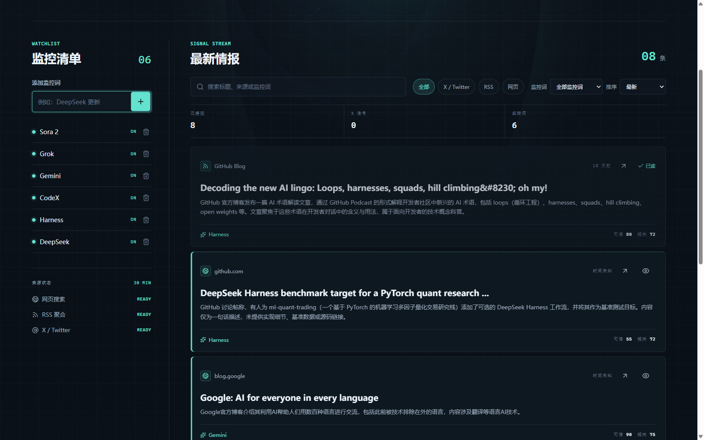

# Hot Monitor 功能介绍 （主创：郭佳仪）

> 运行地址：`http://localhost:5173`（Web 控制台）｜`http://localhost:8787`（后端 API）
> 本文档基于 2026-09-21 实际运行截图整理。

## 一、项目是什么

项目链接：https://github.com/weixinyang1980/hot_monitor

Hot Monitor（AI 情报台）是一个面向研发团队的 **AI 热点监控工具**。它围绕用户添加的监控关键词，自动从多个渠道采集技术动态，经 AI 研判（相关性、技术性、可信度）后筛选，最终在网页控制台呈现一份"值得看、值得分享"的热点情报流。

一句话概括：**你定关键词，它定时扫，AI 打分筛选，你只看精华。**

## 二、整体界面

控制台为单页应用，深色科技风设计（含聚光灯、流星、光束等动态背景，遵循系统"减弱动态效果"设置时自动关闭）。页面分三块：

| 区域 | 作用 |
| --- | --- |
| 顶部页头 | 品牌 LOGO、服务在线状态、下次自动扫描倒计时、「立即扫描」按钮 |
| Hero 横幅 | 当日日期、主题标语、下一轮收集时间（时:分:秒 实时倒计时） |
| 左侧「监控清单」面板 | 关键词管理 + 数据来源健康状态 |
| 右侧「最新情报」面板 | 情报流：搜索、筛选、排序、分页、已读管理 |


## 三、核心功能详解

### 1. 监控关键词管理（左侧面板）

- **添加**：输入框输入关键词（如 `DeepSeek 更新`）回车即可添加，默认监控范围为"AI 大模型、AI 编程、开源模型、科技公司动态"。
- **启停**：点击关键词右侧开关，可在 ON / OFF 之间切换（OFF 的词不再参与扫描与筛选，不删除历史配置）。
- **删除**：点击垃圾桶图标，弹出确认框后删除。
- 面板标题处的数字徽标实时显示"当前启用中的监控词数量"。

当前演示数据中有 5 个监控词：Gemini、CodeX、Harness、DeepSeek、Grok。


添加监控词（输入 `Sora 2` 后回车，计数从 5 变 6）：



### 2. 数据来源状态监控（左侧面板底部）

实时显示三类采集来源的就绪状态：

| 来源 | 说明 | 依赖配置 |
| --- | --- | --- |
| 网页搜索 | Firecrawl 搜索可信网页与新闻 | `FIRECRAWL_API_KEY` |
| RSS 聚合 | 内置 8 个高质量 RSS 源（Hugging Face Blog、OpenAI News、Google AI Blog、AWS ML Blog、微软研究院、GitHub Blog、TechCrunch AI、VentureBeat AI），每个源带内置质量分（78~96） | 无需配置，开箱即用 |
| X / Twitter | twitterapi.io 热门推文 | `TWITTERAPI_API_KEY` |

状态为 `READY` 即可正常采集；未配置密钥时显示 `CONFIG` 提示。

### 3. 情报流查看与操作（右侧面板）

每条情报卡片包含：

- **来源信息**：来源类型图标（网页/RSS/X）、来源名称、相对发布时间（如"18 天前"，无时间显示"时间未知"）
- **标题 + AI 摘要**：摘要由 AI 生成，中文转述原文要点
- **两个操作**：外链图标跳转原文（新标签页打开）；眼睛图标标记已读（已读卡片半透明显示 + 绿色"已读"标签）
- **底部标签**：命中的监控词 + 两个量化评分——**可信分**（来源质量与 AI 判定综合）与**相关分**（与监控词的相关度）


标记已读效果（第一条卡片变半透明，右上角出现"已读"）：


### 4. 搜索、筛选与排序

- **搜索框**：按标题、摘要、来源名、监控词全文模糊搜索，实时过滤（如搜 `Gemini` 命中 3 条），支持一键清除。
- **来源筛选**：全部 / X·Twitter / RSS / 网页 四个快捷按钮。
- **监控词筛选**：下拉框只看某个监控词命中的情报。
- **排序**：`最新`（按发布时间倒序）或 `最相关`（按相关分倒序）。
- 任意筛选生效后出现**重置按钮**，一键恢复默认视图。


按"最相关"排序（相关分 95 → 95 → 75 依次排列）：


筛选无结果时的空状态提示（含"重置筛选"按钮）：


### 5. 分页浏览

情报流每页固定 6 条，超过自动分页，支持上一页/下一页切换，页码实时显示。


### 6. 手动扫描与自动扫描

- **自动扫描**：后端每 30 分钟（每逢整点/半点）自动执行一轮采集，页头实时显示"下次扫描时间 + 倒计时"。
- **手动扫描**：点击右上角「立即扫描」立即触发。扫描过程中：
  - 页头状态变为"正在捕捉信号"，按钮显示转圈动画并禁用
  - 旧情报列表清空，显示"情报流暂时安静"占位
  - 扫描完成后通过 WebSocket 实时推送，页面自动刷新出新情报，无需手动刷新


实测一次手动扫描：耗时约 3.5 分钟，从 78 条原始来源中筛选出 10 条入库，页面实时更新：


### 7. 移动端适配

窄屏（如 375px 手机宽度）下自动切换为单列布局，监控面板与情报流纵向排列，可直接用手机浏览器访问。


## 四、一次扫描的内部流程

结合源码，每轮扫描（`src/scan.ts`）的处理链条如下：

```
启用中的监控词
      │
      ▼
多渠道采集（RSS 8 源 + Firecrawl 网页搜索 + X/Twitter）──► 78 条原始信号
      │
      ▼
AI 逐条研判（DeepSeek，4 并发）：是否相关/技术性/内容类型/可信度分类/生成中文摘要
      │
      ▼
质量门槛过滤（story-selection.ts）：相关分、关键词聚焦分、可信分达标才保留；
非 Twitter 高质量来源有放宽的兜底通道；X 内容占比有上限控制
      │
      ▼
按综合分（相关 45% + 关键词聚焦 30% + 可信 25%）择优入库 ──► 10 条
      │
      ▼
WebSocket 推送前端实时刷新 + 可选邮件通知（SMTP）
```

## 五、技术架构速览

| 层 | 技术 | 说明 |
| --- | --- | --- |
| 前端 | React 19 + Vite 5 + TypeScript | 单页应用，Socket.IO 实时通信 |
| 后端 | Node.js + Express 5 + Socket.IO | REST API + WebSocket 推送 |
| 数据库 | SQLite（better-sqlite3） | 本地文件 `data/hot-monitor.db`，零运维 |
| AI 研判 | DeepSeek API | 相关性/技术性/可信度判定与中文摘要 |
| 采集 | RSS 直连 + Firecrawl + twitterapi.io | 三类来源互补 |
| 校验 | Zod | 请求参数校验 |

常用 API：

| 接口 | 方法 | 用途 |
| --- | --- | --- |
| `/api/health` | GET | 健康检查、来源状态、下次扫描时间 |
| `/api/keywords` | GET / POST | 查询 / 新增监控词 |
| `/api/keywords/:id` | PATCH / DELETE | 启停 / 删除监控词 |
| `/api/stories` | GET | 查询情报流（最多 100 条） |
| `/api/stories/:id/read` | PATCH | 标记已读 |
| `/api/scans` | POST | 触发手动扫描 |
